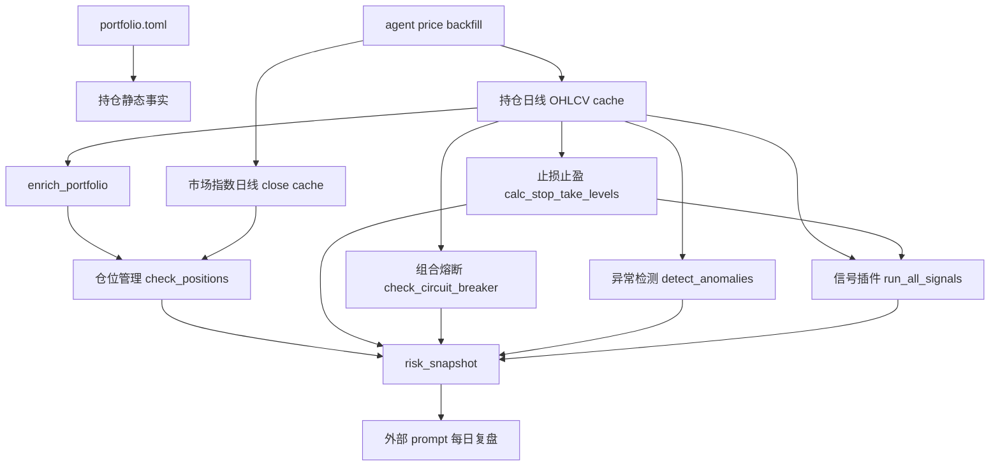
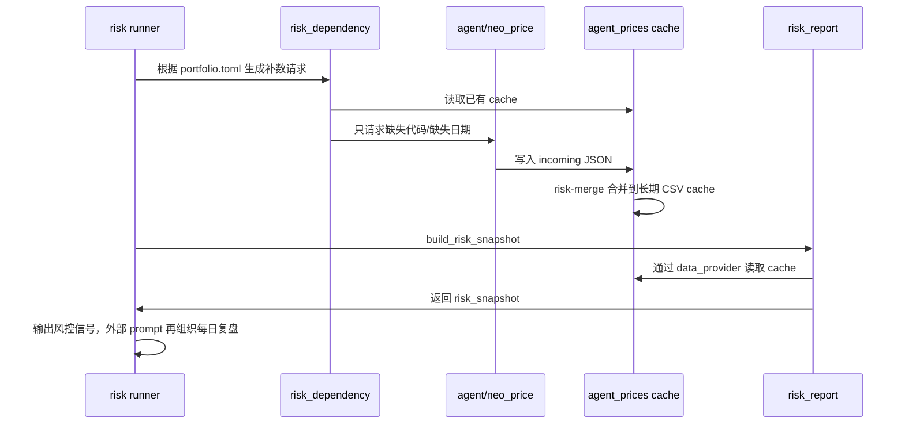

# 风控补数数据依赖图

目标：在没有稳定金融数据源时，让 agent 按风控计算逻辑补齐最小必要数据；本地项目只负责读取结构化数据并执行风控规则。

## 总览

风控标准流程：

1. 检查风控策略依赖的数据范围：`risk_control/data_dependencies.py` 根据当前策略、持仓和市场指数生成需求。
2. 数据获取：agent 只获取行情事实，按 requirements 写入 incoming。
3. 数据合并：`risk_control/agent_price_cache.py` 合并、去重、校验并写入长期 cache。
4. 跑风控策略：`risk_control/scripts/risk_report.py` 默认只读取本地 cache 执行策略。
5. 输出结论模板：导出 `risk_snapshot` 和 `risk_report`，外部 prompt 再组织每日复盘正文。



## 补数原则

- agent 只补行情事实，不输出止损、止盈、加减仓结论。
- 本地风控只读取 cache，所有信号仍由代码计算。
- 每条补数必须带可追踪来源；agent 先写 incoming JSON，本地 `risk-merge` 负责合并、去重、排序和校验。
- 日线数据必须按交易日升序，字段名固定为 `date/open/high/low/close/volume`。
- 复盘日缺行情时，可以补最近一个有效交易日，但必须标注 `as_of_date != review_date`。

## 最小补数集

| 数据对象 | 覆盖范围 | 必需字段 | 最少长度 | 用途 |
|---|---|---|---:|---|
| 持仓日线 | portfolio.toml 中全部持仓 | `date, open, high, low, close, volume` | 60 个交易日 | 当前价格、ATR、移动止损、熔断、异常、相关性、支撑位 |
| 市场指数日线 | `risk_control.config.MARKET_INDEX` | `date, close` | 20 个交易日 | 市场波动率、建议仓位 |
| 买入日日线 | 启用 `entry_day_low_guard` 的持仓 | `date, low` | 买入日当天 | 入场保护止损 |
| 持仓静态事实 | portfolio.toml | `code, name, market, quantity, cost_price, buy_date, risk_rules, trade_plan, familiarity_detail` | 当前快照 | 仓位、成本、止损模式、熟悉度上限 |
| 账户事实 | portfolio.toml `[account]` | `total_equity` | 当前快照 | 总仓位、单票权重、权益风险预算止损 |

建议 agent 一次性补：每只持仓回溯 90 个自然日或不少于 60 个交易日的 OHLCV；市场指数回溯 45 个自然日或不少于 20 个交易日 close。这样可覆盖当前所有信号。

## 信号依赖矩阵

| 模块/信号 | 输入数据 | 历史窗口 | 缺数后影响 |
|---|---|---:|---|
| `enrich_portfolio` 当前价格 | 持仓 `close[-1]` | 1 日 | 缺失时回退成本价，浮盈亏和仓位会失真 |
| `check_positions` 总仓位 | `market_value = close[-1] * quantity`、`total_equity` | 1 日 | 仓位、单票超限、行业超限失真 |
| `check_positions` 建议仓位 | 市场指数 `close` | 20 日 | 市场波动率为 0，建议仓位偏宽松 |
| ATR 止损 `atr` | 持仓 `high/low/close` | 14 日 | 无法计算止损价，止损信号缺失 |
| 分批止盈 | `current_price`、`cost_price` | 1 日 | 止盈触发判断失真 |
| 移动止损 | 持仓 `high/low/close` | 14 日 | `recent_high` 和 ATR 缺失，移动止损信号缺失 |
| 入场保护止损 | 买入日 `low`、`price_tick` | 买入日 | 无法使用入场低点保护，回退 ATR |
| 权益风险预算止损 | `cost_price`、`quantity`、`total_equity` | 0 日 | 不依赖行情历史，但仍需要当前价判断是否触发 |
| 组合熔断 | 全部持仓 `close`、`quantity` | 60 日 | 日/周/月回撤无法可靠计算 |
| 波动率突变 | 持仓 `close` | 25 日 | 异常信号缺失 |
| 流动性枯竭 | 持仓 `volume` | 21 日 | 量比信号缺失 |
| 相关性过高 | 多持仓 `close` | 60 日 | 相关性信号缺失 |
| 持仓周期长期亏损/停滞 | `current_price`、`cost_price`、本地 state | 1 日 | 收益率判断失真 |
| 持仓周期趋势走弱 | 持仓 `close` | 20 日 | MA20 趋势信号缺失 |
| 动态止损升级 | 持仓 `high/low/close`、本地 state | 14 日 | 阶段止损升级和触发信号缺失 |
| 金字塔加仓 | 持仓 `high/low/close`、`volume` 非必需 | 20 日 | 支撑位判断缺失 |
| `stop_loss_basic/trailing_stop/take_profit_tiered` | `sl_levels` | 继承止损止盈 | 上游 `sl_levels` 缺失则插件无信号 |

## Agent 补数请求契约

```json
{
  "review_date": "2026-05-08",
  "lookback_trading_days": 60,
  "holdings": [
    {
      "code": "601985",
      "name": "中国核电",
      "market": "上海",
      "quantity": 24300,
      "cost_price": 9.07,
      "buy_date": "20260508",
      "stop_loss_strategy": "atr",
      "required_series": ["ohlcv_daily"],
      "required_fields": ["date", "open", "high", "low", "close", "volume"]
    }
  ],
  "market_indices": [
    {"code": "000001", "name": "上证指数", "weight": 0.5, "required_fields": ["date", "close"]},
    {"code": "000300", "name": "沪深300", "weight": 0.3, "required_fields": ["date", "close"]},
    {"code": "HK.800000", "name": "恒生指数", "weight": 0.2, "required_fields": ["date", "close"]}
  ]
}
```

## Agent 补数返回契约

```json
{
  "review_date": "2026-05-08",
  "source": "neo_price_agent",
  "fetched_at": "2026-05-08T18:30:00+08:00",
  "prices": {
    "601985": [
      {"date": "2026-05-08", "open": 9.05, "high": 9.12, "low": 8.98, "close": 9.07, "volume": 123456789}
    ]
  },
  "indices": {
    "000001": [
      {"date": "2026-05-08", "close": 4179.95}
    ]
  },
  "degradations": [
    {
      "code": "HK.800000",
      "scope": "market_index",
      "reason": "未查询到复盘日行情，使用最近可用交易日",
      "as_of_date": "2026-05-07"
    }
  ]
}
```

agent 不直接写长期 CSV，只写入：

```text
data/cache/agent_prices/incoming/YYYYMMDD.json
```

随后运行：

```bash
./quickstart.sh risk-merge YYYY-MM-DD
```

合并后的长期 cache：

```text
data/cache/agent_prices/prices/{code}.csv
data/cache/agent_prices/indices/{code}.csv
```

CSV 按日期倒序保存，方便人工打开时优先看到最新数据。

## 分层执行 routine



## 当前实现改造顺序

1. `risk_control/data_dependencies.py` 从 `portfolio.toml` 和 `MARKET_INDEX` 生成补数请求。
2. agent 按请求写入 `data/cache/agent_prices/incoming/YYYYMMDD.json`。
3. `quickstart.sh risk-merge` 合并、去重、排序到长期 CSV cache。
4. `risk` 默认要求 cache 覆盖关键行情；缺关键数据时直接提示补数请求，不再假装风控可靠。
5. 报告中披露每个持仓的行情来源、`as_of_date` 和降级原因。
